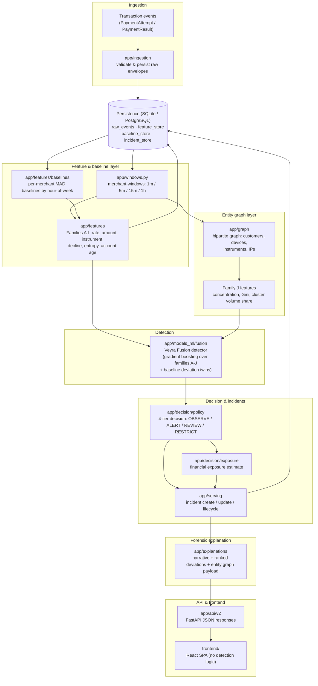

# Veyra

**Contextual fraud-spike detection for merchant payment traffic.**
Research prototype: Razorpay AI Buildathon 2026, Track 02 (AI Risk Manager).

---

## What is Veyra?

A merchant going from 30 to 500 orders in five minutes may be running a flash sale, or may
be under a card-testing attack. The two are **identical in volume** and completely different
in composition and entity relationships. Telling them apart is the whole product.

> **A volume anomaly is evidence, not a verdict.**

Veyra learns what normal payment behaviour looks like for a specific merchant at a specific
hour of the week, detects abnormal change in **volume, composition and relationships**,
judges whether that change is consistent with coordinated abuse rather than legitimate
demand, estimates financial exposure, and emits an explainable risk incident.

The unit of detection is the **merchant-window**, `(merchant_id, window_size, window_end)`,
not the individual transaction. Coordination is a property of a group; a single payment
carries no evidence that it belongs to a ring.

## Key capabilities

All of the following are implemented and exercised by the test suite:

- **Multi-horizon temporal aggregation**: the same traffic scored over 1m, 5m, 15m and 1h.
  A sharp burst surfaces in short windows; a deliberately slow ramp only appears in long ones.
- **Per-merchant historical baselines**: expected median and variability per merchant, per
  hour-of-week, with deviation reported in MAD (median absolute deviation), so a past attack
  cannot quietly redefine "normal".
- **Contextual feature extraction**: 79 features across ten families (A–J): transaction
  rates, amount distributions, instrument novelty, decline velocity, entropy, account age.
- **Entity graph analysis**: a bipartite graph over customers, device fingerprints, payment
  instruments and network addresses; coordination shows up as *concentration*.
- **Fusion scoring**: volume, contextual and graph detectors combined into one risk score.
- **Decision policy**: four tiers (OBSERVE / ALERT / REVIEW / RESTRICT) selected by expected
  loss, with financial-exposure estimation. Veyra **recommends; it never auto-blocks**.
- **Forensic explanation**: a written narrative plus ranked feature deviations and the entity
  graph, exportable as Markdown, CSV or JSON.
- **Model-backed demo scoring**: `/v2/demo/simulate` scores every run with a real fitted
  `VeyraFusionDetector`, trained on a synthetic corpus that ends before any demo window
  begins. The scenario's own ground-truth label is shown for comparison and never read when
  computing the score.
- **Synthetic Data Explorer**: every demo run's transactions, features and entity graph stay
  inspectable for a bounded time — paginated, capped, and clearly marked as synthetic.
- **Scale Lab**: bounded, chunked workload benchmarks from 100K to 100M events, splitting
  ingestion (write) scale from detection (computation) scale, with explicit completion
  statuses so a partial run is never reported as complete.
- **Security**: authenticated principals, tenant-scoped queries, encrypted/tokenized
  identifiers, fail-closed production configuration.

## Architecture overview



A transaction event is persisted, then sliced into merchant-windows that feed two parallel
analyses: statistical features with per-merchant baselines, and an entity graph over the
window's devices, instruments and addresses. Both feed a single fusion detector, whose score
drives a four-tier decision and an exposure estimate; the two together open or update an
incident, which is turned into a forensic explanation and served to the frontend over the
API. Persistence (`raw_events`, `feature_store`, `baseline_store`, `incident_store`) is a
cross-cutting layer that ingestion, features, baselines and incidents all read from or write
to, not a separate pipeline stage.

`app/serving/` orchestrates that pipeline; `app/core/` holds config, auth, crypto and
logging; `app/models/` holds SQLAlchemy tables and repositories. The offline evaluation
harness (`app/evaluation/`, `data/generators/`, `research/`) that produces the benchmark
below shares the same feature and detector code but runs outside the serving path, scoring
pre-generated synthetic timelines instead of live traffic.

**The frontend contains no detection or scoring logic.** If the API is unreachable the UI
shows an explicit connection error rather than fabricating a result.

## Tech stack

| Layer | Technology |
|---|---|
| API | FastAPI, Pydantic v2, Uvicorn |
| Persistence | SQLAlchemy 2 (async), Alembic, SQLite by default / PostgreSQL supported |
| Cache | Redis (optional; the app runs without it) |
| Detection | NumPy, scikit-learn, NetworkX |
| Frontend | React 19, TypeScript, Vite 8, three.js, lucide-react |
| Tooling | pytest, Hypothesis, ruff, mypy, oxlint |

## Project structure

```
├── app/                  FastAPI backend: the whole detection system
│   ├── api/              HTTP routes (v1 ingestion, v2 detection) + middleware
│   ├── core/             config, auth, crypto, db, logging, ids
│   ├── ingestion/        event intake
│   ├── features/         feature families + historical baselines
│   ├── graph/            entity graph construction and metrics
│   ├── models_ml/        volume / contextual detectors and fusion
│   ├── decision/         tier policy, operating point, exposure model
│   ├── explanations/     narrative + visual evidence generation
│   ├── serving/          pipeline orchestration (scoring, incidents)
│   ├── models/           SQLAlchemy tables and repositories
│   ├── schemas/          Pydantic request/response contracts
│   ├── evaluation/       offline benchmark harness (not on the serving path)
│   ├── registry.py       loads research/*.yaml: single source of feature truth
│   └── windows.py        window arithmetic
│
├── frontend/             React SPA: pages, components, typed API client
├── data/generators/      synthetic traffic generators (a source package, not data)
├── research/             feature + scenario registry (YAML): loaded at runtime, gated in CI
├── alembic/              database migrations
├── tests/                unit · integration · property · evaluation · security
├── scripts/              benchmark, baseline fitting, audits
├── reports/              generated evaluation output (JSON is gitignored)
└── artifacts/            generated datasets + model bundles (gitignored)
```

Two names worth explaining, because they are not what they look like:

- **`data/`** is a Python package of *generators*, not a data directory. It is imported as
  `data.generators.*` and ships in the wheel.
- **`research/`** is not scratch work. `app/registry.py` loads `features.yaml` and
  `matrix.yaml` at runtime, and CI fails if they drift from the code.

## Getting started

Requires **Python 3.11+** and **Node 20+**.

```bash
git clone https://github.com/Amartya989870xxxx/Veyra.git
cd Veyra

# --- backend ---------------------------------------------------------------
python -m venv .venv && source .venv/bin/activate     # Windows: .venv\Scripts\activate
pip install -e ".[dev]"
cp .env.example .env                                   # defaults work as-is for local
python -m uvicorn app.main:app --port 8008 --reload

# --- frontend (second terminal) --------------------------------------------
cd frontend
npm install
cp .env.example .env                                   # optional; defaults to :8008
npm run dev
```

Backend on <http://localhost:8008> (OpenAPI docs at `/docs`), frontend on
<http://localhost:5173>.

No database setup is needed: SQLite is the default and the schema is created on startup.
For PostgreSQL, set `VEYRA_DATABASE_URL` and run `alembic upgrade head`.

> **CORS note.** Outside production the API allows `localhost:5173` (dev) and
> `localhost:4173` (`npm run preview`). Any other origin must be added to
> `VEYRA_CORS_ALLOWED_ORIGINS`.

## Application pages

| Page | What it does | Backed by |
|---|---|---|
| **Overview** | Problem-first landing page with product-relevant 3D stream network topology visualizer, interactive "Same spike. Different conclusion." story contrasting legitimate flash sales vs card testing, walkthrough video showcase, and audience breakdown | `GET /v2/demo/scenarios` |
| **Detection** | Core risk-operations console: select scenario, simulate traffic stream, read a model-scored verdict across 6 evidence tabs (Why it was flagged, Detection pipeline, Synthetic data explorer, Entity network, Historical comparison, Transaction events), featuring an AI forensic dossier with typewriter Markdown streaming and the real 12-stage server-side execution trace | `POST /v2/demo/simulate` |
| **Scale Lab** | Bounded, chunked workload benchmarks (100K–100M events) reporting measured ingestion throughput, sampled per-window computation latency, traced memory, storage growth and representative synthetic samples, with explicit `completed` / `stopped_early` / `capped` / `failed` / `rejected` statuses | `POST /v2/demo/benchmarks` |
| **Data Explorer** | Inspect the exact synthetic transactions, feature vector and entity topology behind any recent demo run, paginated and bounded | `GET /v2/demo/runs/{run_id}/*` |
| **Architecture** | Walkable map of the 10-stage core detection pipeline plus the demo's 12-stage execution trace and the Scale Lab benchmark pipeline, with modules, ADR decisions, inputs, outputs and design trade-offs | static |
| **Documentation** | Developer reference with two-layer structure: "IN SIMPLE TERMS" plain-language summaries followed by "TECHNICAL DETAILS" engineering specs, covering the detection pipeline, synthetic provenance, the data explorer and the Scale Lab contract | static |

## API

All application routes live under `/v2`. `/api/v1/events` remains mounted for ingestion.

| Method | Path | Purpose |
|---|---|---|
| `GET` | `/health` | Liveness, version, environment |
| `GET` | `/v2/demo/scenarios` | Supported scenarios with attack/benign flags |
| `POST` | `/v2/demo/simulate` | Generate and model-score a scenario; full 12-stage trace and forensic report |
| `POST` | `/v2/demo/stress-test` | Inject a small fixed-size burst, return measured stage timings |
| `GET` | `/v2/demo/runs/{run_id}` | Metadata, entity graph and links for one stored demo run |
| `GET` | `/v2/demo/runs/{run_id}/transactions` | Paginated synthetic transactions behind a run (page size capped at 200) |
| `GET` | `/v2/demo/runs/{run_id}/features` | Full feature vector for a run, grouped by family |
| `GET` | `/v2/demo/runs/{run_id}/summary` | Composition, time range and entity counts for a run |
| `GET` | `/v2/demo/runs/{run_id}/entities` | Entity topology: counts, ratios, cluster concentration, bipartite Gini |
| `GET` | `/v2/demo/benchmarks/presets` | Workload presets, tiers, and this server's configured guardrails |
| `POST` | `/v2/demo/benchmarks` | Queue a Scale Lab benchmark; returns immediately with a `run_id` |
| `GET` | `/v2/demo/benchmarks/{run_id}/progress` | Cheap polling target for an in-flight benchmark |
| `GET` | `/v2/demo/benchmarks/{run_id}` | Full benchmark run, including the result once terminal |
| `GET` | `/v2/demo/benchmarks` | Recent benchmark runs held in the bounded registry |
| `POST` | `/v2/score-window` | Score an already-ingested merchant-window |
| `GET` | `/v2/incidents` | List incidents (filter by merchant, status) |
| `GET` | `/v2/incidents/{id}` | One incident with its evidence payload |
| `POST` | `/v2/incidents/{id}/action` | Acknowledge / apply defence / dismiss / resolve |
| `GET` | `/v2/merchants/{id}/baselines` | Stored baselines behind a merchant's comparisons |

Money fields serialise as **strings**, not floats; they are Decimals server-side. Parse them
at the formatting boundary. Every demo response carries a `provenance` block
(`data_source: "synthetic"`, `is_production_data: false`, plus a `ground_truth_semantics`
note) so a client never has to infer where the data came from.

## Scale Lab

`POST /v2/demo/benchmarks` runs a bounded, chunked synthetic workload against the real
database and the real detector, splitting two questions that scale differently:
**ingestion** (generate, validate, persist — `events_per_second`) and **computation**
(feature extraction, entity graph, model inference on a sampled subset of
merchant-windows — `per_window_latency_ms`, milliseconds *per merchant-window*, not per
transaction). Results are measured on this server against SQLite; they describe this
environment, not production capacity.

A run reports exactly one terminal status, in this precedence:

```
failed  >  stopped_early  >  capped  >  completed
```

A workload that hits the wall-clock budget is **`stopped_early`**, never `completed`, even
if the safety ceiling also capped its target — the two facts are independently readable
(`capped: true/false`) but only one becomes the headline. `rejected` means the request was
refused before anything ran (currently: an experimental-tier request when experimental
benchmarks are disabled).

Guardrails, as currently configured (`VEYRA_BENCHMARK_*` environment variables):

| Guardrail | Default |
|---|---|
| Hard event ceiling | 2,000,000 events/run |
| Wall-clock budget | 120 seconds/run |
| Chunk size | 20,000 events, generated and persisted incrementally |
| Sampled windows (pipeline mode) | 150 max |
| Concurrent benchmarks | 1 |
| Representative samples | 8 per bucket (legitimate / fraud / random), reservoir-sampled |

Every benchmark's rows are deleted from the database before its result is returned, and a
result never returns the full generated workload — only bounded aggregates and samples.

## Testing

```bash
pytest                              # full suite (slow tests excluded by default)
pytest -m slow                      # long-running evaluation tests
pytest tests/unit                   # one tier
ruff check .                        # lint
python research/validate.py --strict # scenario matrix gate (also runs in CI)

cd frontend && npm run build && npm run lint
```

## Known gaps

Stated plainly, because they are real:

- **`ruff check .` reports ~384 findings** (mostly `E501` line length, `F401` unused imports).
  These are not auto-fixed: in this codebase `F401` can be load-bearing, since SQLAlchemy
  model registration and `__init__` re-exports both depend on imports that look unused.
- **`app/api/v1/health.py` is never mounted.** It defines `/health`, `/ready` and
  `/api/v1/metrics`, but `main.py` defines its own `/health` inline, so `/ready` and the
  metrics endpoint are unreachable. Left in place deliberately: deleting it removes those
  capabilities, mounting it changes behaviour. Needs a decision.
- **No automated frontend tests**: typecheck, lint and build are the safety net.
- Baselines need history; demo endpoints synthesize a fresh merchant per call, so their
  baseline comparisons are thinner than a merchant with accumulated traffic.
- Scale Lab throughput and latency figures come from the project environment against
  SQLite. They describe that machine, not production capacity.
- At the default 120-second wall-clock budget, Scale Lab workloads at or above roughly
  500K events typically report `stopped_early` rather than `completed` on a modest
  development machine; raise `VEYRA_BENCHMARK_MAX_SECONDS` to run larger presets to
  completion.
- The demo scoring model (`veyra_fusion_demo`) is deliberately small — one merchant
  profile, one week of training history — so a browser click does not wait minutes for a
  fit. It illustrates the pipeline; the statistically meaningful evaluation is the offline
  harness in `scripts/run_experiment.py` (`research/BENCHMARK_RESULTS.md`).

## Defence only

Veyra is a **detection** system. It simulates attack patterns offline, in synthetic data, to
measure whether it can catch them. It contains no attack tooling: no credential testing, no
card-testing automation, no evasion infrastructure, nothing that runs against a live system.

## Source discipline

Claims in this repository are labelled by origin: **Razorpay-published fact**, **external
research**, **synthetic benchmark assumption**, or **Veyra experimental result**. Cost
constants are assumptions we chose and document, never presented as Razorpay economics.

This README is the documentation for this repository. The executable scenario matrix in
[`research/matrix.yaml`](research/matrix.yaml) is the machine-readable companion to it: it
declares every scenario and feature the system claims to handle, and CI fails if the code
drifts from it.

## Disclaimer

**This is a research prototype evaluated entirely on synthetic data.** It has never been
validated against real payment traffic, holds no compliance certification (not PCI-DSS,
SOC 2 or GDPR), and does not replace or claim to outperform any production payment-risk
platform. No Razorpay data was used at any point.
